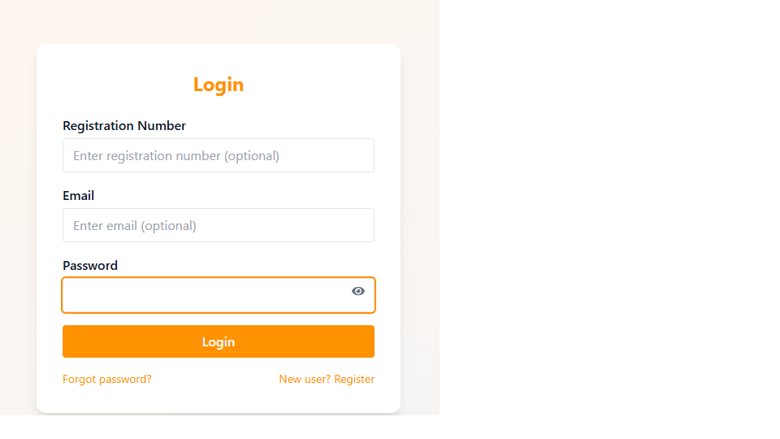
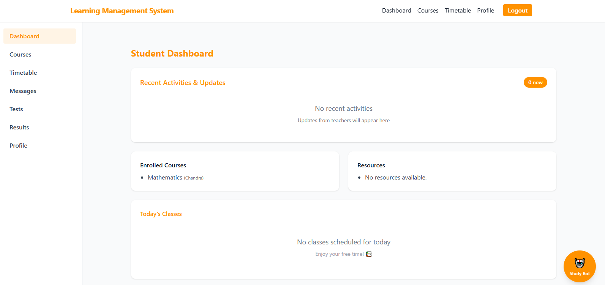
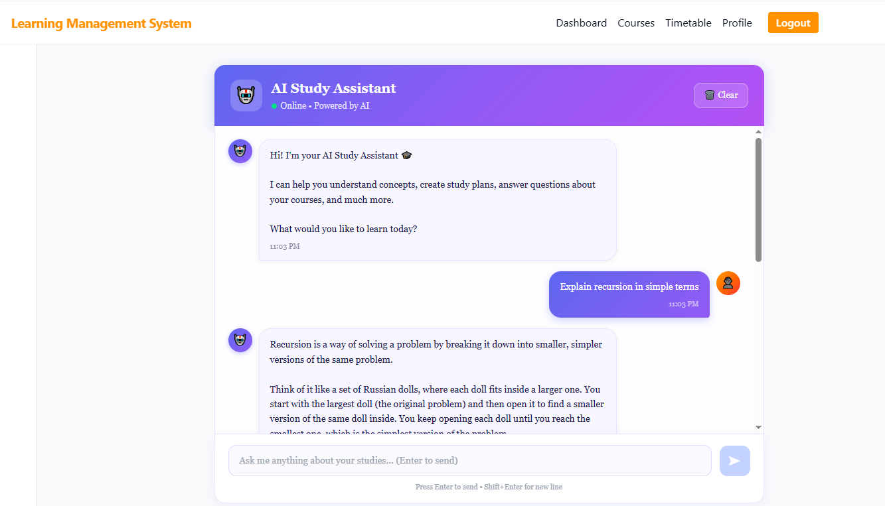
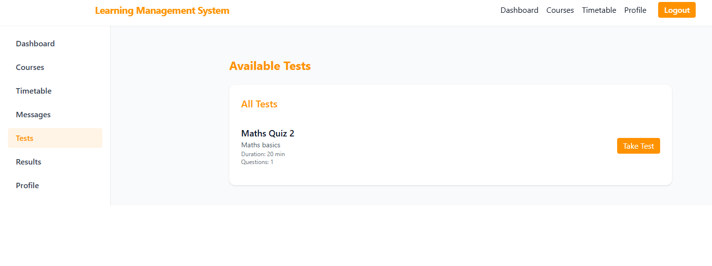
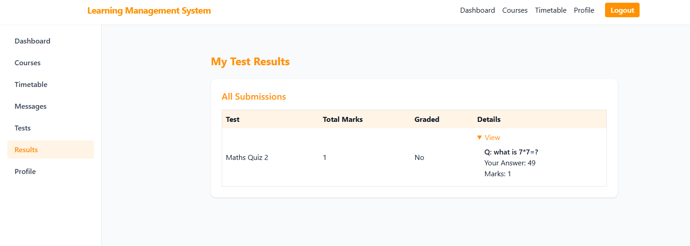
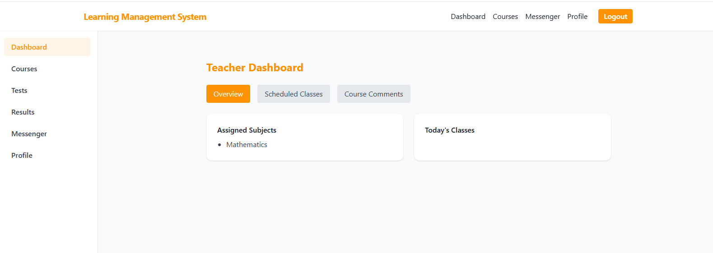
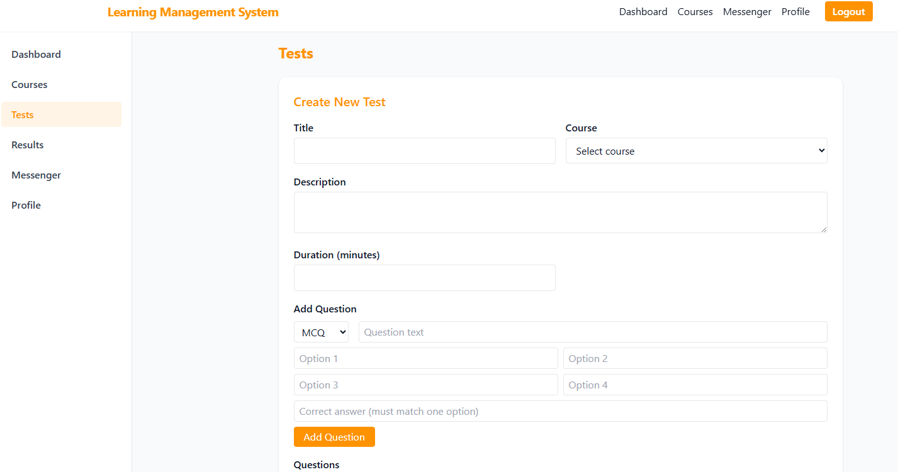
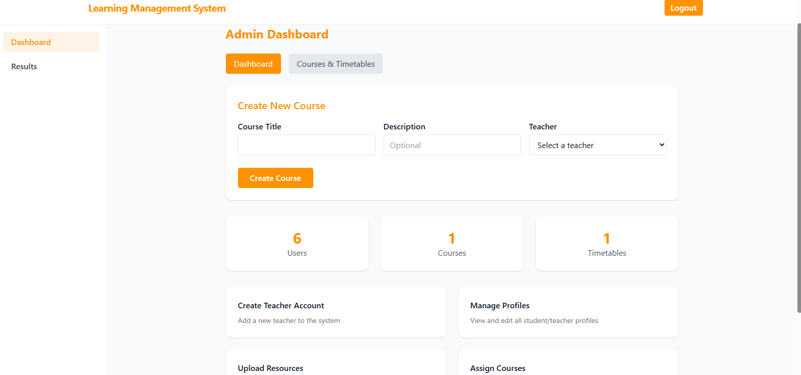

# 🎓 Smart Learn — Learning Management System

A full-stack **Learning Management System** built with React + Vite and Node.js + Express + MongoDB, supporting three user roles: Students, Teachers, and Admins. It includes an AI-powered Study Bot, assessments, course management, communication tools, responsive dashboards, and a Parent QR-based Student Report.


---

## 📸 Screenshots

<details>
<summary>👆 Click to view screenshots</summary>

### Login


### Student Dashboard


### AI Study Bot


### Parent QR / Student Report
> Add the final Parent QR / Parent Report screenshot here if you want it displayed in the repository README.

### Student Tests


### Results


### Teacher Dashboard


### Teacher Test Management


### Admin Dashboard


</details>
---

## ✨ Features

### 🎯 Multi-Role Authentication
- JWT-based login for Students, Teachers, and Admins
- OTP email verification for password reset
- Role-based route protection on both frontend and backend

### 👨‍🎓 Student
- Dashboard with enrolled courses, resources and today's classes
- Take MCQ and theory tests with timer
- View results and performance summary
- AI Study Bot powered by Groq
- Notes and reminders
- Timetable and messages from teachers
- **Parent Access QR** to open a standalone student academic report

### 👨‍🏫 Teacher
- Dashboard with assigned subjects and class schedule
- Create, publish and manage tests (MCQ + theory)
- Grade theory submissions and give feedback
- Upload course resources (PDF, image, video)
- Messenger to communicate with students
- View student performance summaries

### 👨‍👩‍👦 Parent Access
- No parent account is required for the QR report flow
- Student generates a Parent Access QR from the Student Dashboard
- QR opens `/parent-report/:studentId`
- Standalone report displays student details, enrolled courses, teacher information, and assessment results

### 👨‍💼 Admin
- Create teacher accounts
- Create courses and assign teachers
- Enroll students into courses
- Assign timetables
- View all results across the platform
- Monitor system stats (users, courses, timetables)

---

## 📌 Current Project Status

The project is currently in the **final testing / competition-presentation phase**.

### Live Deployment

- **Frontend:** `https://smart-lms-three.vercel.app/`
- **Backend API:** `https://smart-lms-kbqd.onrender.com/api`
- **Database:** MongoDB Atlas

### Main completed areas

- Student, Teacher, and Admin modules
- Responsive UI across the main application pages
- AI Study Bot
- Tests and results workflow
- Teacher resources and communication
- Parent QR → standalone Student Report flow

## 🛠 Tech Stack

### Frontend
- React 18 + Vite
- React Router DOM
- Axios
- Tailwind CSS
- Framer Motion

### Backend
- Node.js + Express 5
- MongoDB + Mongoose
- JWT Authentication
- bcryptjs
- Multer (file uploads)
- Nodemailer (OTP emails)
- Groq SDK (AI Study Bot)

### Security
- MongoDB injection sanitization
- Secure HTTP headers
- JWT-based authentication and role-based access control
- Environment variables for secrets and API configuration
- Backend-side access checks for protected operations
- Environment-gated debug endpoints where configured

---

## ⚡ Getting Started

### 1. Clone the repo
```bash
git clone https://github.com/bs-bhaskar/smart-lms.git
cd smart-learn-lms
```

### 2. Backend setup
```bash
cd lms-server
npm install
cp .env.example .env
# Fill in your MONGO_URI, JWT_SECRET, and GROQ_API_KEY in .env
npm run setup-admin
npm run dev
```

Backend runs on: `http://localhost:5000`

### 3. Frontend setup
```bash
cd lms-client
npm install
cp .env.example .env
# Set VITE_API_BASE_URL=http://localhost:5000/api
# Production: VITE_API_BASE_URL=https://smart-lms-kbqd.onrender.com/api
npm run dev
```

Frontend runs on: `http://localhost:5173`

---
## 🏥 Health Check

The backend exposes a health endpoint to check server and database status:
```
GET http://localhost:5000/health
```

Response when healthy:
```json
{
  "status": "ok",
  "database": "connected"
}
```

Response when database is down:
```json
{
  "status": "degraded",
  "database": "disconnected"
}
```

## 🔐 Environment Variables

### `lms-server/.env`
```
PORT=5000
NODE_ENV=development
MONGO_URI=your_mongodb_atlas_uri
JWT_SECRET=your_jwt_secret
EMAIL_HOST=smtp.gmail.com
EMAIL_PORT=587
EMAIL_USER=your_email@gmail.com
EMAIL_PASS=your_app_password
GROQ_API_KEY=your_groq_api_key
ENABLE_DEBUG_ENDPOINTS=false
ADMIN_NAME=Your Name
ADMIN_EMAIL=your_email@gmail.com
ADMIN_PASSWORD=your_password
```

### `lms-client/.env`
```
VITE_API_BASE_URL=http://localhost:5000/api
```

---

## 📚 API Overview

### Auth
| Method | Endpoint | Access |
|--------|----------|--------|
| POST | `/api/auth/login` | Public |
| POST | `/api/auth/register` | Public |
| POST | `/api/auth/forgot-password` | Public |
| POST | `/api/auth/reset-password` | Public |
| POST | `/api/auth/change-password` | Authenticated |

### Student
| Method | Endpoint | Access |
|--------|----------|--------|
| GET | `/api/student/dashboard` | Student |
| GET | `/api/student/profile` | Student |
| GET/POST | `/api/student/study-bot` | Student |
| GET | `/api/student/timetable` | Student |
| GET | `/api/student/notes` | Student |
| GET | `/api/student/reminders` | Student |
| GET | `/api/student/parent-report/:studentId` | Public |

### Parent Report
| Method | Endpoint | Access |
|--------|----------|--------|
| GET | `/api/student/parent-report/:studentId` | Public QR report |

### Teacher
| Method | Endpoint | Access |
|--------|----------|--------|
| POST | `/api/teacher/create-test` | Teacher |
| POST | `/api/teacher/publish-test` | Teacher |
| GET | `/api/teacher/tests` | Teacher |
| POST | `/api/teacher/grade-submission` | Teacher |
| GET | `/api/teacher/results` | Teacher |

### Admin
| Method | Endpoint | Access |
|--------|----------|--------|
| POST | `/api/admin/create-teacher` | Admin |
| POST | `/api/admin/courses` | Admin |
| POST | `/api/admin/assign-course` | Admin |
| POST | `/api/admin/assign-timetable` | Admin |
| GET | `/api/admin/monitor` | Admin |

---

## 📱 Parent QR & Student Report

The Parent QR feature allows a student to share a simple QR code with a parent.

```text
Student Dashboard
      ↓
Parent Access QR
      ↓
Scan QR
      ↓
/parent-report/:studentId
      ↓
GET /api/student/parent-report/:studentId
      ↓
Standalone Parent Report
```

### Report includes

- Student name
- Email
- Registration number
- Enrolled courses
- Course teacher details
- Test / assessment results
- Marks and percentage
- Grading / submission status

The QR contains the report URL with the student's ID; it does not embed the complete report data inside the QR.

### Local development note

A QR generated on `localhost` contains a `localhost` URL. Scanning it from a phone normally points to the phone's own localhost. For a phone demo, use the deployed Vercel frontend URL or configure a LAN-accessible development URL.

## 🧪 Running Tests

```bash
cd lms-server
npm test
```

---

## 📁 Project Structure

```
smart-learn-lms/
├── lms-client/
│   ├── src/
│   │   ├── pages/
│   │   │   ├── admin/
│   │   │   ├── teacher/
│   │   │   ├── student/
│   │   │   ├── parent/
│   │   │   └── auth/
│   │   ├── components/
│   │   ├── context/
│   │   └── routes/
│   └── package.json
├── lms-server/
│   ├── controllers/
│   ├── middleware/
│   ├── models/
│   ├── routes/
│   ├── utils/
│   ├── config/
│   ├── test/
│   └── package.json
└── screenshots/
```

---

## 🎤 Competition Demo Flow

Recommended order for the final project presentation:

1. **Login** — demonstrate role-based authentication
2. **Student Dashboard** — courses, timetable, tests, and Parent QR
3. **Parent QR** — scan and open the standalone Student Report
4. **AI Study Bot** — demonstrate AI-assisted learning
5. **Teacher Module** — courses, resources, tests, grading, messaging
6. **Admin Module** — teacher/course/timetable management and system overview
7. **Responsive UI** — show mobile-friendly navigation and layouts

## 🗺 Roadmap

- [x] Deploy frontend to Vercel
- [x] Deploy backend to Render
- [x] Implement Parent QR / Student Report
- [x] Complete responsive UI pass
- [ ] Add CI pipeline for lint/test/build
- [ ] Improve integration test coverage
- [ ] Add real-time notifications
- [ ] Expand parent features with optional authenticated parent accounts

## 🔐 Admin Email & Password Change

To change the existing Admin's login email and password, use the `change-admin-password.js` script.

### 1. Open `lms-server/.env`

Add or update:

```env
ADMIN_NEW_EMAIL=newadmin@gmail.com
ADMIN_NEW_PASSWORD=NewStrongPassword123
```

### 2. Run the script
```env
cd lms-server
node change-admin-password.js
```

### 3. Restart the backend
```bash
npm run dev
```

### 4. Login with the new credentials
```bash
Email: newadmin@gmail.com
Password: NewStrongPassword123
```
